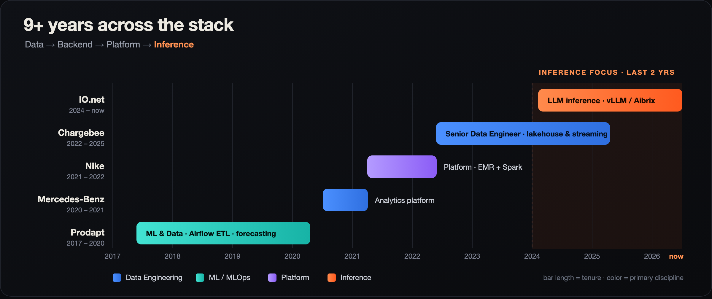

<h1 align="center">Hi, I'm Gurunath 👋</h1>

  <b>Inference &amp; Platform Engineer</b> — I build the machinery that makes intelligence <i>move</i>.
   
  From billion-row data pipelines to the inside of an LLM's KV&nbsp;cache.

  
  
  
  
  

---

### 🚀 Currently

**Senior ML &amp; Software Engineer @ [IO.net](https://io.net)** — driving **LLM inference infrastructure** for a decentralized GPU cloud.

- ⚡ **Serve &amp; fine-tune** open LLMs (Qwen, GLM, DeepSeek, LLaMA) on **vLLM + Aibrix** for low-latency enterprise inference (`io-intelligence`)
- 🧠 **KV-cache optimization** &amp; distributed cache offloading to cut memory footprint and latency at scale
- 🔀 **Disaggregated prefill / decode** cluster deployments improving TTFT and token throughput
- 🌐 Integrated `io-intelligence` as a provider on **OpenRouter**, expanding ecosystem reach
- 🤖 Shipped a **ChatGPT-style** unified interface (web search, image/video gen, RAG) and an **MCP server** that lets agents spin up &amp; manage GPU clusters programmatically
- 🪙 Pioneered a **block-rewards system** for DePIN GPU suppliers — A/B-tested distribution formulas behind the **IO-COIN launch on Solana**, driving multi-million-dollar savings

### 🗺️ The arc

**9+ years** across the stack — data → backend → platform → **inference** — with the last two years concentrated on LLM inference, built on a foundation of large-scale data &amp; platform engineering.

  

**Track record**

- **2024 → now · [IO.net](https://io.net)** — LLM **inference** infra, AI agents &amp; DePIN reward systems for a decentralized GPU cloud
- **2022 → 2025 · Chargebee** — **Senior Data Engineer**: built the enterprise **lakehouse &amp; streaming platform** moving 1–5B records/day (benchmarked to 100B), plus usage-based billing pipelines and a docs RAG chatbot
- **2021 → 2022 · Nike** — Platform team: managed big-data service on **AWS EMR + Spark**, org-wide job orchestration on EKS
- **2020 → 2021 · Mercedes-Benz** — analytics platform end to end: ingestion → interactive dashboards → PDF reporting
- **2017 → 2020 · Prodapt** — Airflow ETL, streaming + batch systems, anomaly detection &amp; time-series forecasting in production

### 🧪 Recently built

Products I've designed &amp; shipped end to end — from idea to deployed AI system:

- **[PitchPerfect](https://pitchperfect-rupeezy.vercel.app/)** — Voice AI for partner programs. An agent that auto-dials inbound partner leads and qualifies them in **9 Indian languages**, handles objections, and hands scored, summarised conversations back to the RM team.
- **[YunoFlow](https://yunoflow.vercel.app/)** — Agentic infrastructure for payments. A full-lifecycle platform to **build → test → fine-tune → deploy → evolve** multi-agent workflows on a real runtime, with tracing, cost and throughput metrics.
- **[Freshet](https://rajagurunath.github.io/freshet/)** — One shared memory for every AI coding session. Captures **Claude Code, Codex &amp; Kilo Code** sessions locally, then curate, redact &amp; peer-review the good ones into a searchable, company-wide memory (AICP open protocol).

### 🧭 What I work on

| | Domain | Focus |
|---|---|---|
| **01** | **Inference Engineering** | KV-cache optimization, distributed cache offloading, disaggregated prefill/decode, low-latency LLM serving |
| **02** | **Data Engineering** | Lakehouses &amp; streaming frameworks moving 1–5B records/day at sub-second latency, benchmarked to 100B |
| **03** | **ML &amp; MLOps** | Research-to-production pipelines, retraining, model promotion, MLOps tooling |
| **04** | **AI &amp; LLM Systems** | RAG pipelines, MCP servers, production agents with observability, tool use &amp; fault tolerance |
| **05** | **Platform &amp; Distributed** | Ray clusters, container-as-a-service, bare metal &amp; EKS/EMR, orchestration with Temporal |
| **06** | **Web3 &amp; DePIN** | Token-reward systems &amp; incentive design for decentralized GPU marketplaces |

### 🛠️ Tech stack

**Inference &amp; ML**

  
  
  
  
  
  
  
  

**AI &amp; LLM Systems**

  
  
  
  
  

**Data &amp; Lakehouse**

  
  
  
  
  
  
  
  
  

**Platform &amp; Infra**

  
  
  
  
  
  

**Languages**

  
  
  
  
  

### 🌱 Out in the open

Open-source contributions &amp; published packages across distributed computing and LLM tooling:

- **[dask-sql](https://github.com/dask-contrib/dask-sql)** — core maintainer
- **[Delta Lake](https://github.com/delta-io/delta)** — bug fixes &amp; CI/CD GitHub Actions pipelines
- **[lakehouse-sharing](https://github.com/rajagurunath/lakehouse-sharing)** — a table-format-agnostic data sharing framework
- **Trino LLM plugin** — LLMs as functions &amp; data sources inside Trino
- **[dask-deltalake](https://github.com/rajagurunath)** · **[streamlit-reactflow](https://github.com/rajagurunath)** · **mlvajra** (MLOps) · **dask-sql-workbench**

### ✍️ Recent writing

Hands-on studies of Preferred Networks' **PLaMo** model family — measured on a single laptop:

- [**Speculative Decoding for PLaMo 2**](https://rajagurunath.github.io/pfn-plamo-inference-study/spec-decode-plamo2.html) — draft-model &amp; n-gram speculation on a Mamba-hybrid model (+ a quantization bug found along the way)
- [**Teaching PLaMo 3 to Call Functions**](https://rajagurunath.github.io/pfn-plamo-inference-study/tool-calling-plamo3.html) — LoRA on hidden control tokens; argument accuracy 55% → 100%
- [**Prefill vs Decode**](https://rajagurunath.github.io/pfn-plamo-inference-study/prefill-decode-study.html) — where the time goes: compute-bound prefill vs bandwidth-bound decode (19× slower/token)

More deep dives on [**guruengineering.substack.com**](https://guruengineering.substack.com/) ↗

### 📊 GitHub stats

  
  

---

  <b>Let's solve something complex together.</b> 
  📍 Chennai, Tamil Nadu, India · open to conversations about inference, platforms &amp; DePIN

